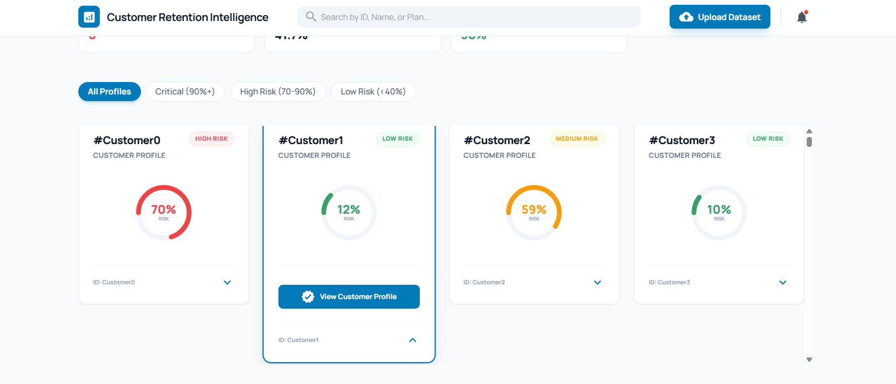

# Customer Retention Agent


---

## Overview
This agent implements an **LLM-based reasoning pipeline** for customer churn prediction and explanation. It combines **SHAP feature importance** with **large language models (LLMs)** to generate human-readable insights, helping businesses understand why a customer may churn and identify actionable strategies for retention.


Once you upload your customer data, the agent generates the following:


Key features include:

- End-to-end workflow for **churn prediction and reasoning**. **(in progress)** 
- **SHAP-based feature analysis** for model interpretability 
- **LLM-powered natural language explanations**  
- **Prompt distillation pipeline** for optimized LLM outputs  
- Modular design for **RAG integration** or future fine-tuning **(in progress)** 

This project showcases a **modern AI workflow**, bridging traditional data science with **LLM-driven reasoning and explainability**, and is designed to support future NLP and retrieval-based extensions.

---

## Running the Application

This application consists of a **FastAPI backend** and a **React + Vite frontend**. Both services must be running simultaneously for the full-stack application to work.

### Prerequisites

Before running the application, ensure you have the following installed:

- **Python 3.10 or higher** (check with `python --version` or `python3 --version`)
- **Node.js 14 or higher** (check with `node --version`)
- **npm** (comes with Node.js, check with `npm --version`)
- **Git** (for cloning the repository)

### Step 1: Environment Variable Setup

The application requires an **OpenRouter API key** to access the LLM service.

1. **Get an OpenRouter API Key:**
   - Visit [OpenRouter.ai](https://openrouter.ai/) and create an account
   - Generate an API key from your dashboard

2. **Create a `.env` file:**
   - In the **project root directory**, create a file named `.env`
   - Add the following line:
     ```
     LLM_KEY_1=your_openrouter_api_key_here
     ```
   - Replace `your_openrouter_api_key_here` with your actual API key

   **Example `.env` file:**
   ```
   LLM_KEY_1=sk-or-v1-abc123def456...
   ```

   **⚠️ Important:** Never commit the `.env` file to version control. It should already be in `.gitignore`.

### Step 2: Backend Setup (FastAPI)

1. **Navigate to the project root directory:**
   ```bash
   cd "Graph Churn Agent"
   ```

2. **Create and activate a virtual environment** (if not already done):

   **Windows:**
   ```bash
   python -m venv venv
   venv\Scripts\activate
   ```

   **macOS/Linux:**
   ```bash
   python3 -m venv venv
   source venv/bin/activate
   ```

3. **Install Python dependencies:**
   ```bash
   pip install --upgrade pip
   pip install -r requirements.txt
   ```

   This will install all required packages including FastAPI, uvicorn, langgraph, crewai, and others.

4. **Start the FastAPI backend server:**
   ```bash
   uvicorn api.main:app --reload --port 8000
   ```

   You should see output like:
   ```
   INFO:     Uvicorn running on http://127.0.0.1:8000 (Press CTRL+C to quit)
   INFO:     Started reloader process
   INFO:     Started server process
   INFO:     Waiting for application startup.
   INFO:     Application startup complete.
   ```

   **Keep this terminal window open** - the backend must remain running.

   **Optional:** Verify the API is working by visiting:
   - API Documentation: http://localhost:8000/docs
   - Alternative docs: http://localhost:8000/redoc

### Step 3: Frontend Setup (React + Vite)

1. **Open a new terminal window** (keep the backend running in the first terminal).

2. **Navigate to the frontend directory:**
   ```bash
   cd frontend
   ```

3. **Install Node.js dependencies:**
   ```bash
   npm install
   ```

   This will install React, Vite, Tailwind CSS, Material UI icons, and other frontend dependencies.

4. **Start the Vite development server:**
   ```bash
   npm run dev
   ```

   You should see output like:
   ```
   VITE v5.x.x  ready in xxx ms

   ➜  Local:   http://localhost:3000/
   ➜  Network: use --host to expose
   ```

   The frontend will automatically open in your browser at `http://localhost:3000`.

   **Keep this terminal window open** - the frontend must remain running.

### Step 4: Using the Application

1. **Access the dashboard:**
   - Open your browser and navigate to `http://localhost:3000`
   - You should see the "Customer Retention Intelligence" dashboard

2. **Upload a CSV file:**
   - Click the "Upload Dataset" button in the header
   - Select a CSV file containing customer data
   - The file will be uploaded and processed asynchronously

3. **Monitor processing:**
   - A loading status will appear showing "Task queued..." or "Processing pipeline..."
   - The frontend polls the backend every 5 seconds for status updates
   - Processing may take several minutes depending on file size

4. **View results:**
   - Once processing completes, customer cards will appear showing:
     - Churn probability (circular progress indicator)
     - Risk level (Low/Medium/High/Critical)
     - Risk drivers and retention strategies (expandable on click)
   - Use the search bar to filter by Customer ID
   - Use filter pills to show specific risk levels
   - Use sort buttons to order by probability or ID

### Running Both Services Together

You need **two terminal windows** running simultaneously:

**Terminal 1 - Backend:**
```bash
# From project root
cd "Graph Churn Agent"
venv\Scripts\activate  # Windows (or: source venv/bin/activate on macOS/Linux)
uvicorn api.main:app --reload --port 8000
```

**Terminal 2 - Frontend:**
```bash
# From project root
cd frontend
npm run dev
```

### Stopping the Application

1. **Stop the frontend:** Press `Ctrl+C` in the frontend terminal
2. **Stop the backend:** Press `Ctrl+C` in the backend terminal
3. **Deactivate virtual environment** (optional):
   ```bash
   deactivate
   ```

---

## Upload a CSV File Application

The application accepts CSV files for customer churn analysis. The CSV file must follow a specific schema to be processed correctly.

### Expected CSV Schema

The CSV file must contain the following columns in the specified order and format. Column names are **case-sensitive** and must match exactly.

#### Column Specification Table

| Column Name | Data Type | Required | Description | Example Values |
|-------------|-----------|----------|-------------|----------------|
| `customerID` | String | Required | Unique customer identifier | `"7590-VHVEG"`, `"5575-GNVDE"` |
| `gender` | String (Categorical) | Required | Customer gender | `"Male"`, `"Female"` |
| `SeniorCitizen` | Integer | Required | Senior citizen status indicator | `0`, `1` |
| `Partner` | String (Categorical) | Required | Whether customer has a partner | `"Yes"`, `"No"` |
| `Dependents` | String (Categorical) | Required | Whether customer has dependents | `"Yes"`, `"No"` |
| `tenure` | Integer | Required | Number of months the customer has been with the company | `1`, `12`, `34`, `72` |
| `PhoneService` | String (Categorical) | Required | Whether customer has phone service | `"Yes"`, `"No"` |
| `MultipleLines` | String (Categorical) | Required | Whether customer has multiple phone lines | `"Yes"`, `"No"`, `"No phone service"` |
| `InternetService` | String (Categorical) | Required | Type of internet service | `"DSL"`, `"Fiber optic"`, `"No"` |
| `OnlineSecurity` | String (Categorical) | Required | Whether customer has online security | `"Yes"`, `"No"`, `"No internet service"` |
| `OnlineBackup` | String (Categorical) | Required | Whether customer has online backup | `"Yes"`, `"No"`, `"No internet service"` |
| `DeviceProtection` | String (Categorical) | Required | Whether customer has device protection | `"Yes"`, `"No"`, `"No internet service"` |
| `TechSupport` | String (Categorical) | Required | Whether customer has tech support | `"Yes"`, `"No"`, `"No internet service"` |
| `StreamingTV` | String (Categorical) | Required | Whether customer has streaming TV | `"Yes"`, `"No"`, `"No internet service"` |
| `StreamingMovies` | String (Categorical) | Required | Whether customer has streaming movies | `"Yes"`, `"No"`, `"No internet service"` |
| `Contract` | String (Categorical) | Required | Contract term | `"Month-to-month"`, `"One year"`, `"Two year"` |
| `PaperlessBilling` | String (Categorical) | Required | Whether customer uses paperless billing | `"Yes"`, `"No"` |
| `PaymentMethod` | String (Categorical) | Required | Payment method used | `"Electronic check"`, `"Mailed check"`, `"Bank transfer (automatic)"`, `"Credit card (automatic)"` |
| `MonthlyCharges` | Float | Required | Monthly charges amount | `29.85`, `56.95`, `103.70` |
| `TotalCharges` | Float/String | Optional | Total charges amount (may be empty or numeric) | `29.85`, `1889.5`, `""` (empty) |
| `Churn` | String (Categorical) | Required | Customer churn status | `"Yes"`, `"No"` |

### Important Notes

#### Data Format Requirements

1. **Column Names:** Column names must match exactly (case-sensitive). The CSV must have a header row with these exact column names.

2. **Categorical Values:** For categorical columns, values must match exactly:
   - Use `"Yes"` and `"No"` (with capital Y/N) for binary categorical fields
   - Use exact strings as shown in the example values column
   - For internet service-related fields, `"No internet service"` is a valid value when the customer has no internet

3. **Numeric Values:**
   - `SeniorCitizen` must be `0` or `1` (integer)
   - `tenure` must be a non-negative integer (months)
   - `MonthlyCharges` and `TotalCharges` should be numeric floats (decimals allowed)
   - `TotalCharges` may contain empty values (handled automatically by the pipeline)

4. **Missing Values:** 
   - Missing values in numeric columns will cause processing errors
   - Missing values in categorical columns should be avoided
   - `TotalCharges` is the only column where empty values are acceptable

5. **File Encoding:** The CSV file should be UTF-8 encoded. Ensure special characters are properly encoded.

6. **File Size:** 
   - Large files (>1000 rows) may take several minutes to process
#### Data Processing Behavior


#### Sample CSV Format

```csv
customerID,gender,SeniorCitizen,Partner,Dependents,tenure,PhoneService,MultipleLines,InternetService,OnlineSecurity,OnlineBackup,DeviceProtection,TechSupport,StreamingTV,StreamingMovies,Contract,PaperlessBilling,PaymentMethod,MonthlyCharges,TotalCharges,Churn
7590-VHVEG,Female,0,Yes,No,1,No,No phone service,DSL,No,Yes,No,No,No,No,Month-to-month,Yes,Electronic check,29.85,29.85,No
5575-GNVDE,Male,0,No,No,34,Yes,No,DSL,Yes,No,Yes,No,No,No,One year,No,Mailed check,56.95,1889.5,No
```

#### Getting Started with Your Own Data

If you have customer data in a different format:

1. **Transform your data** to match the schema above
2. **Ensure column names match exactly** (case-sensitive)
3. **Validate categorical values** match the expected values
4. **Check for missing values** in required fields
5. **Save as UTF-8 encoded CSV** file

### Data Processing Phase

The data processing stage is implemented in the `Data_Processing` class and focuses on preparing categorical features for analysis of the churn variable.

Several categorical features were converted into binary-encoded representations. This decision was informed by exploratory analysis, where specific categories within these features showed a strong majority association with either churn (`1`) or non-churn (`0`). Based on this observation, binary indicators were used to preserve the dominant signal while simplifying the feature space.

**Key steps performed by `processData()` include:**

- Creation of derived binary indicator columns:
  - `isElectronic`: Stacked bar plots revealed that Electronic Check users churn at 45.3%, significantly higher than Bank Transfer (16.7%), Credit Card (15.2%), and Mailed Check (19.1%). I  encoded this as a binary feature isElectronic = 1 for Electronic Check users and 0 for all others to capture the primary churn driver.
  - `isFiber`: The stacked bar plots indicated that Fiber Optic customers churn at 41.9%, far exceeding DSL (19%) and No Internet (7.4%). Accordingly, I created a binary feature isFiber = 1 for Fiber Optic users and 0 otherwise, highlighting the highest-risk category in a simplified format.
  - `isMonth`: Analysis of stacked bar plots showed that customers on Month-to-Month contracts churn at 42.7%, compared to 11.3% for One-Year and 2.8% for Two-Year contracts. To capture this dominant signal, I created a binary feature isMonth = 1 for Month-to-Month contracts and 0 otherwise, simplifying the feature space while preserving the strongest predictive signal.

- Binary encoding of `"Yes"` / `"No"` categorical fields:
  - `Partner`
  - `Dependents`
  - `MultipleLines`
  - `OnlineSecurity`
  - `OnlineBackup`
  - `DeviceProtection`
  - `TechSupport`
  - `StreamingTV`
  - `StreamingMovies`
  - `Churn`

- Explicit conversion of all encoded features to integer type (`0` or `1`)

- Removal of features that were determined during exploratory analysis to have no observable effect on the churn variable:
  - `customerID`
  - `PaperlessBilling`
  - `gender`
  - `PhoneService`
  - `TotalCharges`
  - `InternetService`
  - `PaymentMethod`
  - `Contract`
  - `OnlineBackup`
  - `DeviceProtection`

The method returns a pandas `DataFrame` containing the processed numerical features.

---

### Hyperparameter Tuning Phase

The hyperparameter tuning stage is implemented in the `Hyperparameter_Tuning` class and is responsible for optimizing a **Random Forest classifier** for churn prediction. The process focuses on maximizing **recall**, ensuring that the model is sensitive to detecting churned customers.  

**Key steps performed by `Hyperparameter_Tuning` include:**  

- **Data Preparation:**  
  - Features (`X`) and target (`y`) are separated from the processed dataset.  
  - Data is split into training and test sets with stratification to preserve the class distribution.  

- **Bayesian Hyperparameter Optimization:**  
  - Uses **Optuna**, a Bayesian optimization framework, to tune the Random Forest.  
  - Hyperparameters optimized include:  
    - `n_estimators`: number of trees in the forest  
    - `max_depth`: maximum depth of each tree  
    - `min_samples_split`: minimum samples required to split a node  
    - `max_features`: proportion of features considered at each split  
  - **5-fold stratified cross-validation** is used to evaluate each hyperparameter combination, and the objective function maximizes **recall**.  

- **Model Training and Threshold Tuning:**  
  - The best hyperparameters are used to fit the final Random Forest model on the training data.  
  - A **custom probability threshold** is calculated to achieve a recall of at least 0.9 on a validation split.  
  - This threshold is applied to convert predicted probabilities into class labels for the test set, improving sensitivity to churned customers.  

- **Model Evaluation and Explainability:**  
  - Recall is reported **before and after applying the optimized threshold**, demonstrating the effect of threshold tuning.  
  - SHAP (SHapley Additive exPlanations) values are computed using a **subset of training data** to explain the contribution of each feature to model predictions.  
  - This ensures that the tuned model is both **accurate and interpretable**.  

**Outputs:**  

- `updated_model`: the trained Random Forest classifier with optimized hyperparameters  
- `optimal_threshold`: probability threshold selected to maximize recall  
- `explainer`: SHAP explainer object for feature-level interpretability

---
## Prompt Distillation Phase

High-quality LLM outputs depend heavily on **prompt design**. This repository includes a **Prompt Distillation module** that identifies the most effective prompt template for your dataset.

### Workflow

1. **Prepare Dataset**  
   - JSON dataset containing customer information, SHAP values, and reference explanations.

2. **Define Prompt Templates**  
   - Multiple candidate templates provided in a JSON file.

3. **Evaluate Templates**  
   - Each prompt template is evaluated on all customers using **semantic similarity metrics** and, additionally, a **manual LLM-based evaluation** to qualitatively assess the relevance and clarity of generated explanations. This manual step provided an extra layer of judgment to select the most effective prompt, complementing the automated metrics.

4. **Aggregate Scores**  
   - Metrics such as **mean, median, and standard deviation** are calculated across all records.

5. **Select Best Template**  
   - The template with the highest average similarity is chosen as the **distilled prompt**, and all results are saved in JSON for reproducibility.

### Benefits

- Demonstrates **expertise in prompt engineering**  
- Combines **traditional ML interpretability** with **modern LLM reasoning**  
- Provides a **robust, and reproducible workflow**    

---
## RAG (Retrieval-Augmented Generation) Pipeline

This project implements a **Retrieval-Augmented Generation (RAG)** pipeline designed to retrieve semantically relevant document context based on user-derived signals and to rigorously evaluate how different document chunking strategies impact retrieval performance.

---

### High-Level Architecture

The RAG system is composed of three core stages:

1. **Document ingestion and chunking**
2. **Vector indexing and retrieval**
3. **Evaluation of retrieval quality using recall-based metrics**

Each stage is modular, allowing chunking strategies and retrieval behavior to be evaluated and compared independently.

---

### Document Ingestion

Source documents are loaded from the filesystem using **LlamaIndex**:

- **Directory:** `RAG_Processing/documents`
- **Loader:** `SimpleDirectoryReader`

These documents form the knowledge base used for retrieval.

---

### Chunking Strategies

To study the effect of chunking on retrieval quality, the pipeline evaluates multiple chunking approaches:

| Strategy | Description |
|--------|-------------|
| **Fixed Chunking** | Splits documents into uniform, fixed-size chunks without semantic awareness |
| **Sentence Chunking** | Splits documents along sentence boundaries |
| **Semantic Chunking** | Creates chunks based on semantic coherence and content similarity |

Each strategy processes the same input documents to ensure fair and consistent evaluation.

---

### Vector Database Construction

For each chunking strategy:
- Document chunks are embedded and indexed using a shared `buildDB` utility
- A separate vector index is created per chunking method
- Each index exposes a retriever interface with configurable top-K similarity search

This design allows direct comparison of retrieval performance across chunking methods.

---

### Retrieval Flow

The retrieval stage is implemented as a **RAG retrieval node** that operates on structured application state.

#### Query Construction
- The retriever consumes a list of **customer-specific reasons** produced upstream in the pipeline
- Each reason is treated as an independent semantic query
- Queries are processed individually to maximize recall

#### Retrieval Process
For each query:
1. Documents are semantically chunked
2. A vector database is built using semantic chunks
3. The retriever returns the **top-5 most similar chunks**
4. Retrieved chunk text is extracted and accumulated as contextual evidence

The final output is a structured list of retrieved context passages aligned with each input reason.

---

### Chunking Strategy Evaluation

Retrieval performance is quantitatively evaluated using a **Recall@K** metric.

#### Evaluation Dataset
- Evaluation queries and ground-truth relevant chunks are loaded from:
  - `RAG_Processing/chunking_eval.json`
- Each entry includes:
  - A query
  - One or more reference chunks considered relevant

#### Recall Computation
- For each query, the retriever returns the top **K = 5** chunks
- Retrieved chunks are compared to reference chunks using **BERTScore**
- A retrieved chunk is considered relevant if:
  - **Recall > 0.85**
- A query is counted as successfully retrieved if **at least one relevant chunk** is found

The final recall score is computed as:

Recall = (Number of queries with ≥ 1 relevant retrieved chunk) / (Total number of queries)

Recall scores are reported independently for each chunking strategy

These results provide empirical insight into how chunk granularity and semantic structure affect retrieval quality.

---

### Key Takeaways

- Chunking strategy has a **significant impact** on retrieval performance.
- Semantic chunking consistently improves recall by preserving contextual coherence.
- Recall-based evaluation combined with semantic similarity scoring provides a robust measure of retrieval effectiveness.
---

###LICESNE LINKS:
- **Authors/Creators:** Asem Omari, Omaia Al-Omari, Tariq Al-Omari, and Suliman Mohamed Fati  
- **Source:** PMC (PubMed Central), article PMC12426120. Available at: https://pmc.ncbi.nlm.nih.gov/articles/PMC12426120/

- **License:** **Creative Commons Attribution 4.0 International License (CC BY 4.0)**. License deed: [https://creativecommons.org/licenses/by/4.0/](https://creativecommons.org/licenses/by/4.0/)  

- **Service:** OpenRouter  
- **API Endpoint:** https://openrouter.ai/api/v1/chat/completions

- **License:** **NVIDIA Open Model License**  
Official license text:  
https://www.nvidia.com/en-us/agreements/enterprise-software/nvidia-open-model-license/

- **Source of the dataset:** https://www.kaggle.com/datasets/vhcg77/telcom-churns-dataset


